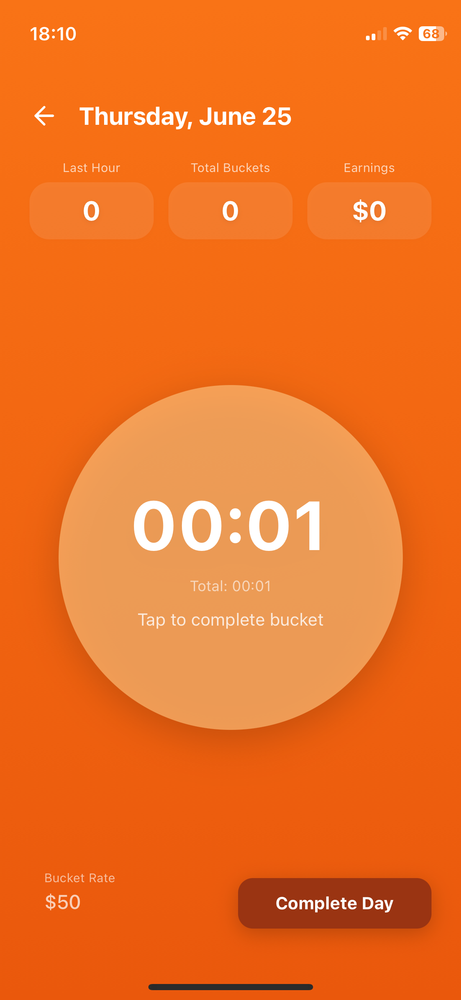
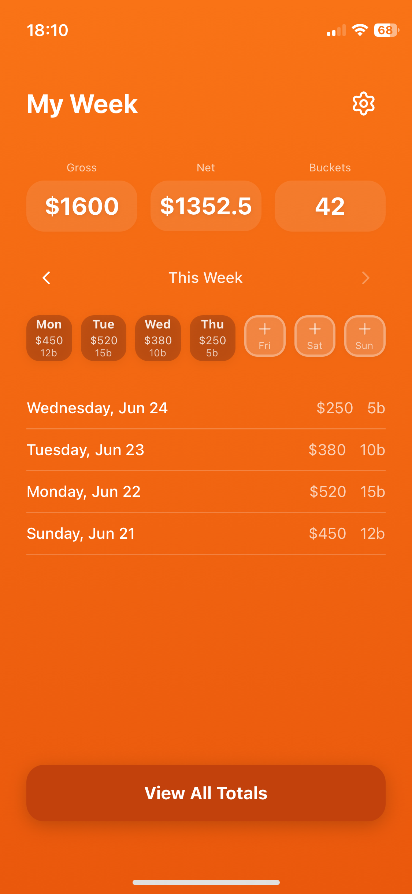
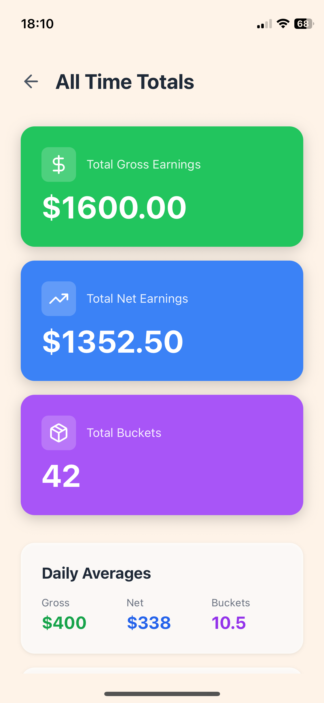
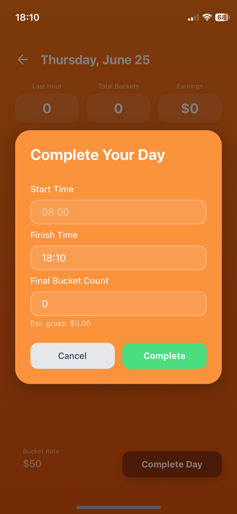
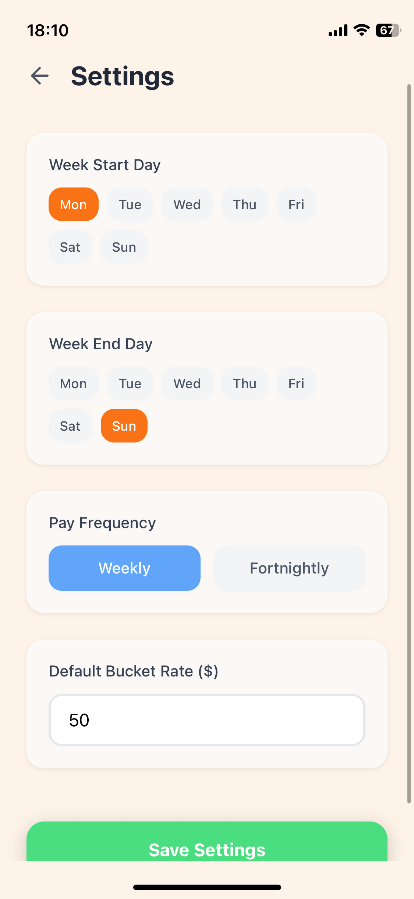

# 🍒 Last Bucket — Cherry Picker Tracker

A mobile app built for cherry pickers to track their buckets, monitor their picking rate, and calculate their actual take-home pay — all in one place.

Built with Expo (React Native). Designed to be fast to use in the field with gloves on.

---

## The problem it solves

Piece rate work like cherry picking has a few pain points this app addresses:

**Rate tracking** — Pickers need to know if they're picking at a good pace *while they're picking*, not at the end of the day. Slow hours are easy to miss without live data.

**Miscount disputes** — The binsitter (the person who counts buckets at the bin) occasionally miscounts. Without a personal record, pickers have no way to prove a discrepancy. This app logs each bucket with a timestamp — if your count differs from the binsitter's, you can show them your phone and pinpoint exactly where the gap is.

**Pay transparency** — Gross pay is easy to calculate. What you actually take home after New Zealand tax is less obvious. The weekly calculator handles the full breakdown so there are no surprises on payday.

---

## Features

- **Live bucket timer** — Tap to start, tap to complete each bucket. Records the time for every single pick.
- **Rate dashboard** — See buckets per hour in real time so you can adjust your pace mid-day.
- **Daily log** — Full timestamped record of every bucket with your final count recorded at end of day.
- **Weekly earnings dashboard** — View gross and net pay across the full week with a per-day breakdown.
- **NZ tax calculator** — Calculates actual take-home pay after New Zealand PAYE tax and ACC levy.
- **Configurable pay rate** — Set your bucket rate at the start of the season, update anytime.
- **Fortnightly pay support** — Toggle between weekly and fortnightly pay periods.

---

## Screenshots

| Day View | Weekly Dashboard | All Time Totals |
|----------|-----------------|-----------------|
|  |  |  |

| Complete Day | Settings |
|-------------|----------|
|  |  |

---

## Tech stack

- [Expo](https://expo.dev) ~54.0.0
- React Native 0.81.5
- expo-linear-gradient
- lucide-react-native
- react-native-svg
- TypeScript
- Built with Cursor (AI-assisted development)

---

## Running locally

```bash
# Clone the repo
git clone https://github.com/johnnyrgraham/cherry-picker-tracker
cd cherry-picker-tracker

# Install dependencies
npm install

# Start the dev server
npx expo start
```

Scan the QR code with the **Expo Go** app on your phone, or press `a` for Android emulator / `i` for iOS simulator.

---

## Roadmap

- [ ] Export daily log as PDF for binsitter disputes
- [ ] Automatic gap detection — flag buckets that took significantly longer than average
- [ ] Student loan repayment deduction in pay calculator
- [ ] Expand to other piece rate work (kiwifruit, apple picking)
- [ ] Orchard / employer selector for multi-site pickers
- [ ] Season summary and historical comparisons
- [ ] Push notifications for pace alerts

---

## Why I built this

I picked cherries myself and felt the pain of not knowing my rate, not having a record when counts didn't match, and not knowing what I'd actually take home. Built the first version in a weekend with Cursor. This is the cleaned-up rebuild.

---

## Contributing

If you pick fruit and have feature ideas, open an issue. This is designed to grow into a tool for all piece rate workers in NZ and beyond.

---

*Built in Dunedin, NZ 🇳🇿*
